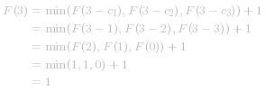

#### 前言

该问题可建模为以下优化问题：

 

其中，*S* 是总金额，*c_i* 是第 *i* 枚硬币的面值，*x_i* 是面值为 *c_i* 的硬币数量，由于 *x_i*c_i* 不能超过总金额 *S* ，可以得出 *x_i* 最多不会超过   ， 所以 *x_i* 的取值范围为![\[{0,\frac{S}{c_i}}\] ](./p___{0,_frac{S}{c_i}}__.png) 。

一个简单的解决方案是通过回溯的方法枚举每个硬币数量子集 ![\[x_0\dots\x_{n-1}\] ](./p___x_0dots_x_{n_-_1}__.png) ，针对给定的子集计算它们组成的金额数，如果金额数为 *S*，则记录返回合法硬币总数的最小值，反之返回 *-1*。

该做法的时间复杂度为 *O(S^n)*，会超出时间限制，因此必须加以优化。

#### 方法一：记忆化搜索

我们能改进上面的指数时间复杂度的解吗？当然可以，利用动态规划，我们可以在多项式的时间范围内求解。首先，我们定义：

- *F(S)*：组成金额 *S* 所需的最少硬币数量 

- ![\[c_{0}\ldotsc_{n-1}\] ](./p___c_{0}ldots_c_{n-1}__.png)  ：可选的 *n* 枚硬币面额值

我们注意到这个问题有一个最优的子结构性质，这是解决动态规划问题的关键。最优解可以从其子问题的最优解构造出来。如何将问题分解成子问题？假设我们知道 *F(S)* ，即组成金额 *S* 最少的硬币数，最后一枚硬币的面值是 *C*。那么由于问题的最优子结构，转移方程应为：
*
F(S) = F(S - C) + 1
*

但我们不知道最后一枚硬币的面值是多少，所以我们需要枚举每个硬币面额值   并选择其中的最小值。下列递推关系成立： 

 
 
 


在上面的递归树中，我们可以看到许多子问题被多次计算。例如， *F(1)* 被计算了 *13* 次。为了避免重复的计算，我们将每个子问题的答案存在一个数组中进行记忆化，如果下次还要计算这个问题的值直接从数组中取出返回即可，这样能保证每个子问题最多只被计算一次。 

```C++ [sol1-C++]
class Solution {
    vector<int>count;
    int dp(vector<int>& coins, int rem) {
        if (rem < 0) return -1;
        if (rem == 0) return 0;
        if (count[rem - 1] != 0) return count[rem - 1];
        int Min = INT_MAX;
        for (int coin:coins) {
            int res = dp(coins, rem - coin);
            if (res >= 0 && res < Min) {
                Min = res + 1;
            }
        }
        count[rem - 1] = Min == INT_MAX ? -1 : Min;
        return count[rem - 1];
    }
public:
    int coinChange(vector<int>& coins, int amount) {
        if (amount < 1) return 0;
        count.resize(amount);
        return dp(coins, amount);
    }
};
```
```Java [sol1-Java]
public class Solution {
    public int coinChange(int[] coins, int amount) {
        if (amount < 1) {
            return 0;
        }
        return coinChange(coins, amount, new int[amount]);
    }

    private int coinChange(int[] coins, int rem, int[] count) {
        if (rem < 0) {
            return -1;
        }
        if (rem == 0) {
            return 0;
        }
        if (count[rem - 1] != 0) {
            return count[rem - 1];
        }
        int min = Integer.MAX_VALUE;
        for (int coin : coins) {
            int res = coinChange(coins, rem - coin, count);
            if (res >= 0 && res < min) {
                min = 1 + res;
            }
        }
        count[rem - 1] = (min == Integer.MAX_VALUE) ? -1 : min;
        return count[rem - 1];
    }
}
```
```Python [sol1-Python3]
class Solution:
    def coinChange(self, coins: List[int], amount: int) -> int:
        @functools.lru_cache(amount)
        def dp(rem) -> int:
            if rem < 0: return -1
            if rem == 0: return 0
            mini = int(1e9)
            for coin in self.coins:
                res = dp(rem - coin)
                if res >= 0 and res < mini:
                    mini = res + 1
            return mini if mini < int(1e9) else -1

        self.coins = coins
        if amount < 1: return 0
        return dp(amount)
```
**复杂度分析**

* 时间复杂度：*O(Sn)*，其中 *S* 是金额，*n* 是面额数。我们一共需要计算 *S* 个状态的答案，且每个状态 *F(S)* 由于上面的记忆化的措施只计算了一次，而计算一个状态的答案需要枚举 *n* 个面额值，所以一共需要 *O(Sn)* 的时间复杂度。
* 空间复杂度：*O(S)*，我们需要额外开一个长为 *S* 的数组来存储计算出来的答案 *F(S)* 。


#### 方法二：动态规划

**算法**

我们采用自下而上的方式进行思考。仍定义 *F(i)* 为组成金额 *i* 所需最少的硬币数量，假设在计算 *F(i)* 之前，我们已经计算出 *F(0)-F(i-1)* 的答案。 则 *F(i)* 对应的转移方程应为 

 

其中 *c_j* 代表的是第 *j* 枚硬币的面值，即我们枚举最后一枚硬币面额是 *c_j*，那么需要从 *i-c_j* 这个金额的状态 *F(i-c_j)* 转移过来，再算上枚举的这枚硬币数量 *1* 的贡献，由于要硬币数量最少，所以 *F(i)* 为前面能转移过来的状态的最小值加上枚举的硬币数量 *1* 。

例子1：假设
```
coins = [1, 2, 5], amount = 11
```
则，当 *i==0* 时无法用硬币组成，为 0 。当 *i<0* 时，忽略 *F(i)*
| F(i)  | 最小硬币数量                                 |
| ----- | -------------------------------------------- |
| F(0)  | 0 //金额为0不能由硬币组成                    |
| F(1)  | 1 //*F(1)=min(F(1-1),F(1-2),F(1-5))+1=1*     |
| F(2)  | 1 //*F(2)=min(F(2-1),F(2-2),F(2-5))+1=1*     |
| F(3)  | 2 //*F(3)=min(F(3-1),F(3-2),F(3-5))+1=2*     |
| F(4)  | 2 //*F(4)=min(F(4-1),F(4-2),F(4-5))+1=2*     |
| ...   | ...                                          |
| F(11) | 3 //*F(11)=min(F(11-1),F(11-2),F(11-5))+1=3* |
我们可以看到问题的答案是通过子问题的最优解得到的。

例子2：假设

```
coins = [1, 2, 3], amount = 6
```


在上图中，可以看到： 
 

```C++ [sol2-C++]
class Solution {
public:
    int coinChange(vector<int>& coins, int amount) {
        int Max = amount + 1;
        vector<int> dp(amount + 1, Max);
        dp[0] = 0;
        for (int i = 1; i <= amount; ++i) {
            for (int j = 0; j < (int)coins.size(); ++j) {
                if (coins[j] <= i) {
                    dp[i] = min(dp[i], dp[i - coins[j]] + 1);
                }
            }
        }
        return dp[amount] > amount ? -1 : dp[amount];
    }
};
```
```Java [sol2-Java]
public class Solution {
    public int coinChange(int[] coins, int amount) {
        int max = amount + 1;
        int[] dp = new int[amount + 1];
        Arrays.fill(dp, max);
        dp[0] = 0;
        for (int i = 1; i <= amount; i++) {
            for (int j = 0; j < coins.length; j++) {
                if (coins[j] <= i) {
                    dp[i] = Math.min(dp[i], dp[i - coins[j]] + 1);
                }
            }
        }
        return dp[amount] > amount ? -1 : dp[amount];
    }
}
```
```Python [sol2-Python3]
class Solution:
    def coinChange(self, coins: List[int], amount: int) -> int:
        dp = [float('inf')] * (amount + 1)
        dp[0] = 0
        
        for coin in coins:
            for x in range(coin, amount + 1):
                dp[x] = min(dp[x], dp[x - coin] + 1)
        return dp[amount] if dp[amount] != float('inf') else -1 
```

**复杂度分析**

* 时间复杂度：*O(Sn)*，其中 *S* 是金额，*n* 是面额数。我们一共需要计算 *O(S)* 个状态，*S* 为题目所给的总金额。对于每个状态，每次需要枚举 *n* 个面额来转移状态，所以一共需要 *O(Sn)* 的时间复杂度。
* 空间复杂度：*O(S)*。数组   需要开长度为总金额 *S* 的空间。